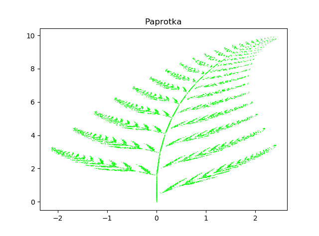
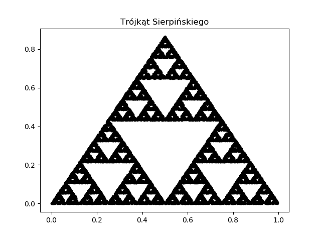
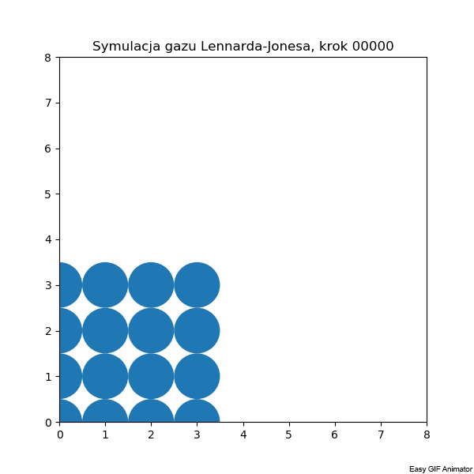
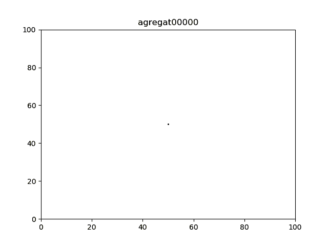

# Programy do symulacji układów fizycznych

Stworzone w ramach zajęć na Wydziale Fizyki UW. Obejmują:
* Dynamikę molekularną:
  * mechanika newtonowska i całkowanie numeryczne
  * metody symplektyczne
  * układy ze stałą temperaturą i termostaty
*  Chaos deterministyczny:
  *   fraktale
  *   nieliniowy model oscylatora z wymuszaniem
  *   obrazowanie chaosu w przestrzeni fazowej
* Monte Carlo (MC):
  * podstawy termicznych, równowagowych symulacji MC
  * pomiar i analiza wyników w ramach MC
* Proste modele sieciowe:
  * agregacja dyfuzyjna
  * automaty komórkowe
  * samoorganizująca się krytyczność
  * kinetyczne modele wzrostu warstw krystalicznych
  
 
 
  
  
